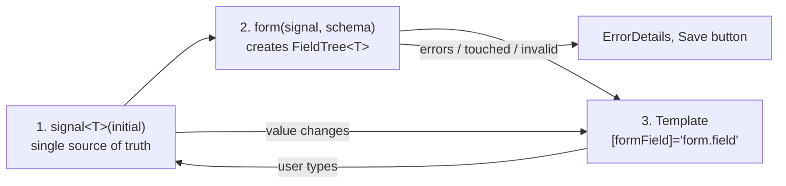
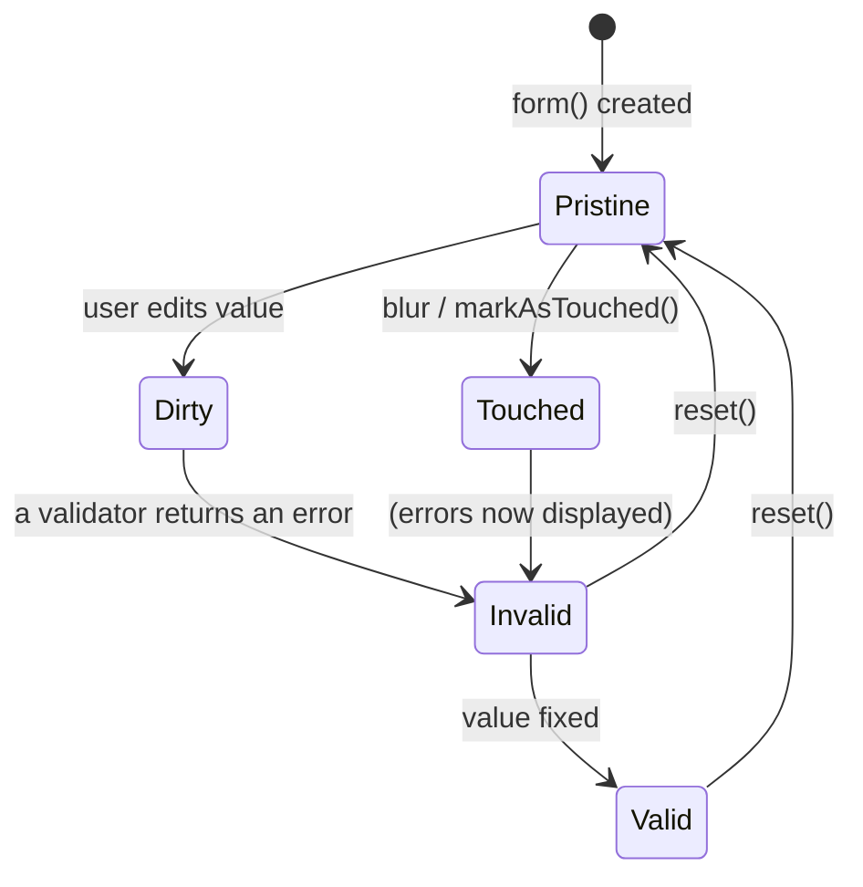
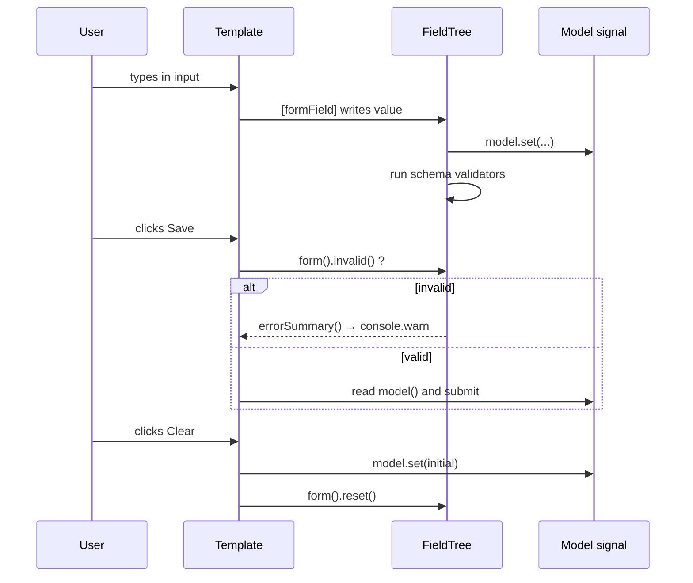
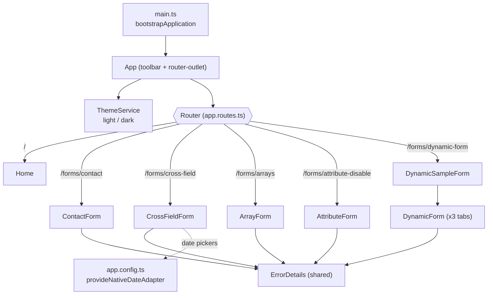
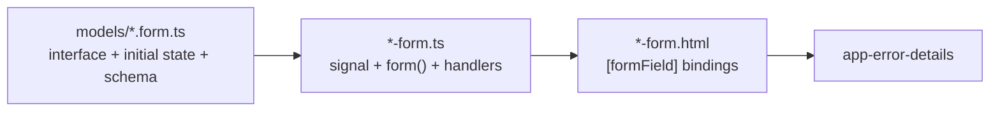
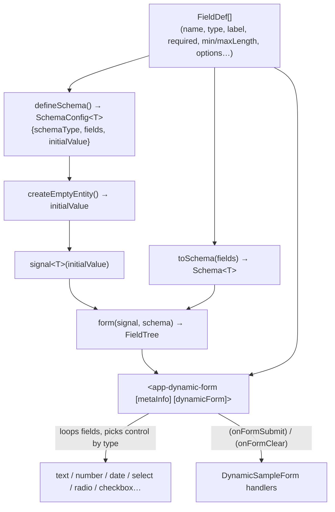
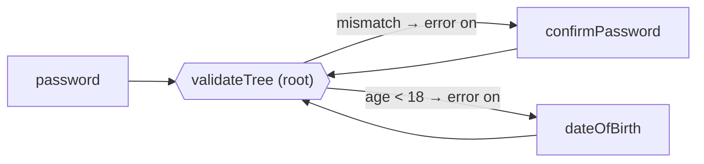
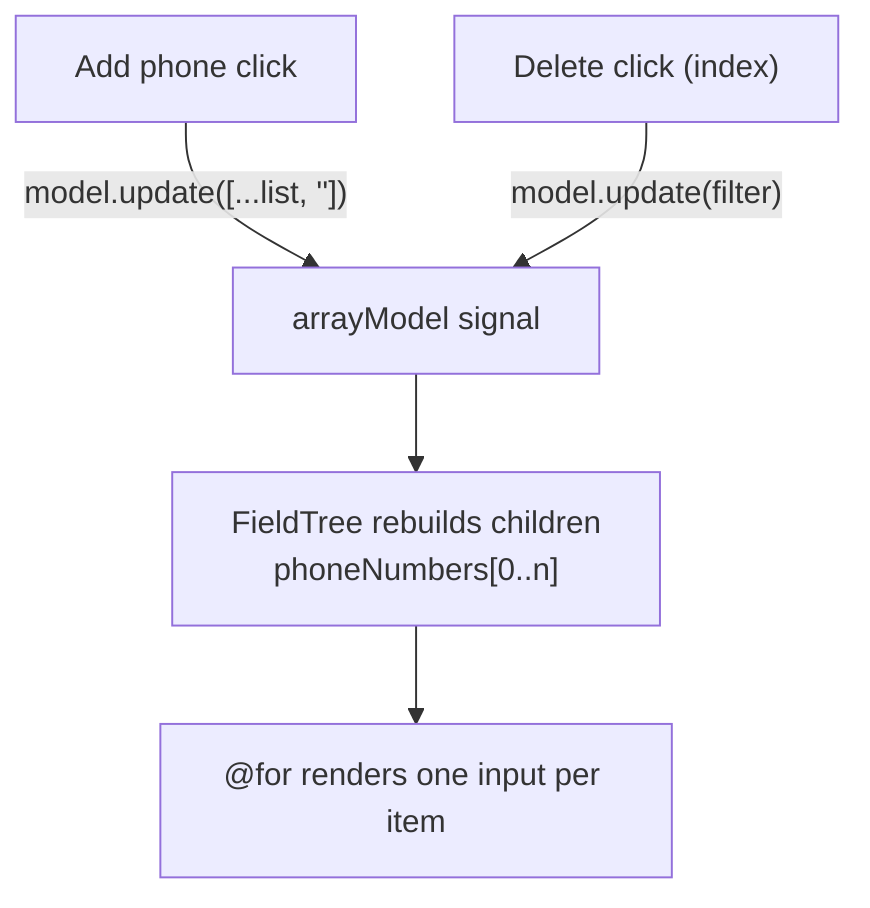
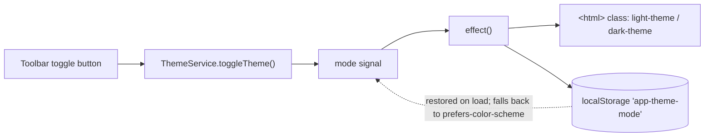

# Angular 22 — Signal Forms Tutorial

A hands-on tutorial project for the **`@angular/forms/signals`** API (Signal Forms).
Instead of `FormControl` / `FormGroup`, the **form state lives in a plain `signal()`** and `form()` wraps it in a
`FieldTree` that exposes validation, touched/dirty/disabled state, and errors as signals.

The app is a set of small, self-contained examples, each one building on the previous concept, styled with Angular Material.

## Temporal API
Had to install the polifill and type

```bash 
    npm install temporal-polyfill
    npm install --save-dev @js-temporal/polyfill
```
A simple converter is as follow
```ts
    protected dateTime: string = new Date().toISOString();
    protected dateTime1: Temporal.Instant = Temporal.Instant.from('2020-01-01T09:00:00Z');
    protected dateTime2: string = Temporal.Instant.from('2020-07-01T09:00:00Z')
        .toZonedDateTimeISO("Asia/Nicosia")
        .toPlainDateTime()
        .toString({ smallestUnit: 'minute' }) // Drops seconds if desired
        .replace('T', ' ');                   // Converts "2026-05-01T10:00" to "2026-05-01 10:00"
```


---

## Contents

1. [Getting started](#-getting-started)
2. [Tech stack](#-tech-stack)
3. [Core concepts](#-core-concepts)
4. [Architecture](#-architecture)
5. [Project structure](#-project-structure)
6. [Examples](#-examples) — Contact, Cross-field, Arrays, Disabled/Readonly, Dynamic
7. [Shared building blocks](#-shared-building-blocks)
8. [Theming](#-theming)
9. [Recipes: how to add your own form](#-recipes)
10. [Known quirks & TODOs](#-known-quirks--todos)

---

## 🚀 Getting started

```bash
npm install
npm start          # ng serve → http://localhost:4200
npm test           # unit tests (Vitest via ng test)
npm run build      # production build
npm run watch      # dev build in watch mode
```

## 📦 Tech stack

| Package | Version |
|---|---|
| Angular (core, forms, router…) | ^22.2.0 |
| Angular Material / CDK | ^22.2.0 |
| RxJS | ~7.8.0 |
| TypeScript | ~6.0.3 |
| Vitest + jsdom | ^4.0.8 / ^27.1.0 |

All components are standalone and use `ChangeDetectionStrategy.Eager` (the form pages) or `OnPush` (the app shell).

---

## 🧠 Core concepts

Every example follows the same three-step recipe:



| Concept | What it is | Example |
|---|---|---|
| **Model signal** | A `WritableSignal<T>` holding the data. Writing to it updates the form and vice-versa. | `signal<ContactDataForm>({...})` |
| **`form(model, schema)`** | Wraps the signal and returns a `FieldTree<T>`. | `form(this.contactModel, contactSchema)` |
| **`FieldTree<T>`** | A navigable tree mirroring the model: `form.firstName`, `form.phoneNumbers[0]`… | `[formField]="form.email"` |
| **`FieldState`** | Calling a field (`form.email()`) returns its state: `value()`, `valid()`, `invalid()`, `touched()`, `dirty()`, `disabled()`, `errors()`, `errorSummary()`, plus `markAsTouched()`, `reset()`. | `form().invalid()` |
| **`[formField]` directive** | Binds a field to a native input / Material control. | `<input matInput [formField]="form.firstName">` |
| **`schema<T>(path => …)`** | A reusable set of rules. `path` is a typed `SchemaPathTree<T>`. | see each `*.form.ts` |
| **Validators** | `required`, `minLength`, `maxLength`, `email`, `pattern`, `min`, `validate`, `validateTree` | `required(path.email, {message})` |

### Lifecycle of a field



Errors are only *shown* once the field is **touched and invalid** (see `ErrorDetails`), so users are not
greeted by red text on a fresh form.

### Typical submit flow



---

## 🏗️ Architecture

### Application map



### Per-feature file pattern



Keeping the **interface, initial value and schema in a `*.form.ts` model file** separates *rules* from *UI* and makes
the schema reusable and unit-testable.

### Dynamic form data flow



---

## 🗂️ Project structure

```
src/app/
├── app.ts / app.html / app.routes.ts / app.config.ts   # shell, routes, date adapter providers
├── core/
│   └── string-date.adapter.ts        # Custom Material DateAdapter<string> (ISO ↔ DD/MM/YYYY)
├── forms/
│   ├── contacts/                     # Basic form
│   │   ├── models/contact-data.form.ts
│   │   └── contact-form/
│   ├── cross-fields/                 # validateTree cross-field rules + Material datepicker
│   │   ├── cross-field-data.form.ts
│   │   └── cross-field-form/
│   ├── arrays/                       # Dynamic list of phone numbers
│   │   ├── models/array-data.form.ts
│   │   └── array-form/
│   ├── disabled-readonly/            # Conditional validation, slide toggle, chip grid
│   │   ├── models/attribute-data.form.ts
│   │   └── attribute-form/
│   ├── dynamic/                      # Metadata-driven forms
│   │   ├── dynamic-form.utils.ts     # defineSchema / createEmptyEntity / toSchema
│   │   ├── form-field.constant.ts    # FormFieldType enum
│   │   ├── interfaces/               # BaseSchema, FieldDef, entity schemas
│   │   ├── dynamic-form/             # Generic renderer component
│   │   └── dynamic-sample-form/      # Flights / Appointments / All-fields tabs
│   └── shared/
│       ├── error-details/            # Reusable <mat-error> list
│       ├── datetime-local.util.ts    # ISO → "yyyy-MM-ddTHH:mm"
│       └── debounce-signal.util.ts   # Debounced Signal<T>
├── home/                             # Landing page cards (form-card.ts = card type)
└── services/theme.service.ts         # Signal-based theme toggle
```

---

## 📋 Examples

| # | Example | Route | Concepts |
|---|---|---|---|
| 1 | Contact Form | `/forms/contact` | `form()`, `required`, `minLength`, `maxLength`, `email`, `pattern` |
| 2 | Cross-Field Validation | `/forms/cross-field` | `validateTree`, `valueOf`, `fieldTreeOf`, Material datepicker |
| 3 | Form Arrays | `/forms/arrays` | array in model, `[formField]="form.list[$index]"`, add/remove |
| 4 | Disabled / Readonly | `/forms/attribute-disable` | conditional `required` (`when`), `validate`, `minError`, `disabled()` state |
| 5 | Dynamic Form | `/forms/dynamic-form` | schema-driven rendering, generic `toSchema()` |

### 1. Contact Form — `/forms/contact`

Fields: **firstName**, **lastName**, **email**, **phone** (optional).

```ts
// models/contact-data.form.ts
export const contactSchema = schema<ContactDataForm>((path) => {
  required(path.firstName, { message: 'First name is required' });
  minLength(path.firstName, 2, { message: 'First name must be at least 2 characters' });
  email(path.email, { message: 'Please enter a valid email address' });
  pattern(path.phone, /^(\+?[\d\s\-().]{7,15})?$/, { message: 'Please enter a valid phone number' });
});
```

```ts
// contact-form.ts
protected readonly contactModel = signal<ContactDataForm>({ firstName: '', lastName: '', email: '', phone: '' });
protected readonly contactForm  = form(this.contactModel, contactSchema);

protected handleSubmit(): void {
  const root = this.contactForm();
  if (root.invalid()) { root.errorSummary().forEach(e => console.warn(e.message)); return; }
  console.log('Submitted:', this.contactModel());
}

protected clearForm(): void {
  this.contactModel.set({ firstName: '', lastName: '', email: '', phone: '' });
  this.contactForm().reset();          // clears touched/dirty so errors disappear
}
```

```html
<mat-form-field appearance="outline">
  <mat-label>First name</mat-label>
  <input matInput [formField]="contactForm.firstName" />
  <app-error-details [formField]="contactForm.firstName" />
</mat-form-field>
```

### 2. Cross-Field Validation — `/forms/cross-field`

Fields: **username**, **password**, **confirmPassword**, **dateOfBirth** (stored as `YYYY-MM-DD`).

`validateTree(path, ctx => …)` runs at the root, reads several fields with `valueOf`, and **targets the error at a
specific field** with `fieldTreeOf`, so the message appears under the right input:

```ts
validateTree(path, ({ valueOf, fieldTreeOf }) => {
  const errors: ValidationError.WithOptionalFieldTree[] = [];

  if (valueOf(path.confirmPassword) && valueOf(path.password) !== valueOf(path.confirmPassword)) {
    errors.push({ kind: 'passwordMismatch', message: 'Passwords do not match',
                  fieldTree: fieldTreeOf(path.confirmPassword) });
  }

  const dob = valueOf(path.dateOfBirth);
  if (dob && calculateAge(dob) < 18) {
    errors.push({ kind: 'minAge', message: 'You must be at least 18 years old',
                  fieldTree: fieldTreeOf(path.dateOfBirth) });
  }
  return errors.length ? errors : null;
});
```

Also included: a strong-password `pattern`, and a **date picker bridged manually** to the string model (the datepicker
works with `Date`, the model with an ISO string):

```ts
protected onDateChange(event: MatDatepickerInputEvent<Date>): void {
  const iso = event.value ? event.value.toISOString().substring(0, 10) : '';
  this.crossFieldForm.dateOfBirth().value.set(iso);
  this.crossFieldForm.dateOfBirth().markAsTouched();
  this.crossFieldForm.dateOfBirth().markAsDirty();
}
```



### 3. Form Arrays — `/forms/arrays` ⭐

The namesake of the project. The model contains an array, and the `FieldTree` **automatically mirrors it**, so
`form.phoneNumbers[$index]` is a fully-fledged field for each item.

```ts
// models/array-data.form.ts
export interface ArrayDataForm {
  id: string; firstName: string; lastName: string;
  phoneNumbers: Array<string>;
}
export const initialState: ArrayDataForm = {
  id: '', firstName: '', lastName: '', phoneNumbers: ['9761 3093'],
};
```

**Add / remove = update the model immutably**; the form follows:

```ts
protected addPhone(): void {
  this.arrayModel.update(cur => ({ ...cur, phoneNumbers: [...cur.phoneNumbers, ''] }));
}
protected removePhone(index: number): void {
  this.arrayModel.update(cur => ({ ...cur, phoneNumbers: cur.phoneNumbers.filter((_, i) => i !== index) }));
}
```

**Template** — loop over the *model*, bind to the matching *field*:

```html
@for (phone of arrayModel().phoneNumbers; track $index) {
  <mat-form-field appearance="outline">
    <mat-label>Phone number</mat-label>
    <input matInput [formField]="arrayDataForm.phoneNumbers[$index]" />
    <button matMiniFab (click)="removePhone($index)"><mat-icon>delete</mat-icon></button>
  </mat-form-field>
}
<button matButton="outlined" (click)="addPhone()">Add phone</button>
```



**Applying a validator to every array item** (not yet in this project's schema — see TODOs) uses `applyEach`:

```ts
import { applyEach, required, pattern } from '@angular/forms/signals';

schema<ArrayDataForm>((path) => {
  applyEach(path.phoneNumbers, (item) => {
    required(item, { message: 'Phone is required' });
    pattern(item, /^[\d\s\-+()]{7,15}$/, { message: 'Invalid phone number' });
  });
});
```

### 4. Disabled / Readonly — `/forms/attribute-disable`

Fields: **alcoholPurchase** (`MatSlideToggle`), **age** (number), **beverage** (`MatChipGrid` of strings).

- `required(path.age, { when: ctx => ctx.valueOf(path.alcoholPurchase) })` — required only when buying alcohol.
- `validate(path.age, …)` returns `minError(18, {...})` only when `alcoholPurchase` is true.
- The chip grid is bound to state with `[disabled]="form.beverage().disabled()"`; the schema contains the
  commented-out alternatives (`min` with a function, `applyWhen`, `disabled(...)`) as learning notes.
- Chips are added/removed by updating the model array, exactly as in the array example.

```ts
validate(path.age, (ctx) => {
  if (!ctx.valueOf(path.alcoholPurchase)) return null;
  return ctx.valueOf(path.age) < 18
    ? minError(18, { message: 'Must be 18 or over to purchase alcohol' })
    : null;
});
```

### 5. Dynamic / Schema-Driven Form — `/forms/dynamic-form`

Describe a form as **data**; the engine renders it and derives validation.

**1. Describe the entity and fields**

```ts
interface FlightSchema extends BaseSchema {   // BaseSchema = { id, schemaType }
  schemaType: 'flight'; from: string; to: string; date: string; delayed: boolean;
}

const flightFormConfig = defineSchema<FlightSchema>({
  schemaType: 'flight',
  fields: [
    { name: 'id',   type: FormFieldType.TEXT, label: 'Id', disabled: true, hidden: true },
    { name: 'from', type: FormFieldType.TEXT, label: 'From', required: true, minLength: 3, maxLength: 20 },
    { name: 'date', type: FormFieldType.DATE_TIME, label: 'Date', required: true },
    { name: 'delayed', type: FormFieldType.CHECKBOX, label: 'Delayed' },
  ],
  initialValue: createEmptyEntity<FlightSchema>('flight', { from: '', to: '', date: '', delayed: false }),
});
```

**2. Build the signal + form**

```ts
protected readonly flightEntity = signal(this.flightFormConfig.initialValue);
protected readonly flightsForm  = form(this.flightEntity, toSchema<FlightSchema>(this.flightFormConfig.fields));
```

**3. Render**

```html
<app-dynamic-form
  [metaInfo]="flightFormConfig.fields"
  [dynamicForm]="flightsForm"
  (onFormSubmit)="handleFlightSubmit()"
  (onFormClear)="handleClearFlightForm()" />
```

#### `FieldDef` reference

| Property | Type | Effect |
|---|---|---|
| `name` | `string` | Property on the model; also the key into the `FieldTree` |
| `type` | `FormFieldType` | Which control is rendered |
| `label` | `string` | Label + used in generated error messages |
| `required` | `boolean?` | Adds `required()` |
| `minLength` / `maxLength` | `number?` | Adds `minLength()` / `maxLength()` |
| `options` | `{label, value}[]?` | Choices for `radio` and `select` |
| `hidden` | `boolean?` | Field is not rendered |
| `disabled` | `boolean?` | Applied to radio `<fieldset>` only (see TODOs) |

#### `FormFieldType`

| Enum | HTML rendering |
|---|---|
| `TEXT`, `PASSWORD`, `SEARCH`, `NUMBER`, `RANGE`, `DATE`, `TIME`, `DATE_TIME`, `CHECKBOX` | `<input [type] [formField]>` |
| `RADIO` | `<fieldset>` of radio inputs (writes via `value.set`) |
| `SELECT` | `<select [formField]>` with `<option>`s |

Three ready-made samples live in tabs: **Flights**, **Appointments**, and an **All Field Types** demo.

---

## 🧩 Shared building blocks

| Piece | Purpose |
|---|---|
| `ErrorDetails` (`<app-error-details [formField]="…">`) | Renders `<mat-error>` for each error, **only when the field is touched and invalid**. Must sit inside a `mat-form-field`. |
| `StringDateAdapter` (`core/`) | A `DateAdapter<string>` letting Material datepickers use ISO strings directly (displays `DD/MM/YYYY`). Available but **not currently wired** in any provider; the cross-field form uses the native adapter + manual conversion. |
| `debounceSignal(source, ms = 300)` | Debounces any signal via `toObservable → debounceTime → toSignal`. |
| `toLocalDateTimeString(iso)` | Converts an ISO string to the `yyyy-MM-ddTHH:mm` format required by `datetime-local` inputs. |
| `ThemeService` | `isDark`, `currentTheme`, `toggleTheme()`, `setTheme()`. |
| `app.config.ts` | `en-GB` locale + `provideNativeDateAdapter` with Intl display formats. |

---

## 🎨 Theming

A custom Material 3 palette (red primary, gold secondary, amber tertiary) lives in `src/styles/_theme-colors.scss`.



Regenerate the palette:

```bash
ng generate @angular/material:theme-color
```

---

## 🍳 Recipes

### Create a new form in 5 steps

1. **Model file** `forms/<name>/models/<name>.form.ts`
   ```ts
   export interface MyForm { name: string; tags: string[]; }
   export const myInitial: MyForm = { name: '', tags: [] };
   export const mySchema = schema<MyForm>((path) => {
     required(path.name, { message: 'Name is required' });
   });
   ```
2. **Component**
   ```ts
   protected readonly model = signal<MyForm>(myInitial);
   protected readonly form  = form(this.model, mySchema);
   ```
3. **Template** — `<input matInput [formField]="form.name" />` + `<app-error-details [formField]="form.name" />`
4. **Buttons** — `[disabled]="form().invalid()"` for Save; on Clear: `model.set(initial); form().reset();`
5. **Route** — add to `app.routes.ts` and a card in `home.ts`.

### Cheat-sheet

| I want to… | Use |
|---|---|
| Read a value | `form.email().value()` or `model().email` |
| Set a value | `form.email().value.set('x')` or `model.update(...)` |
| Know if the whole form is valid | `form().valid()` / `form().invalid()` |
| List all errors | `form().errorSummary()` |
| Show errors after interaction | `field().touched() && field().invalid()` |
| Reset UI state | `form().reset()` (also reset the model signal if you want the values cleared) |
| Validate one field against another | `validateTree(path, ({valueOf, fieldTreeOf}) => …)` |
| Validate each array item | `applyEach(path.list, item => …)` |
| Conditional rule | `required(path.x, { when: ctx => … })` |

---

## ⚠️ Known quirks & TODOs

Things noticed while reading the code — useful as exercises:

- **Array form:** the phone-number rows show `<app-error-details [formField]="arrayDataForm.lastName">` instead of the
  phone field, and there is no validation on `phoneNumbers` yet (use `applyEach`, see above).
- **Home page:** the *Async Validation* (`/forms/async`) and *Standard Schema* (`/forms/standard-schema`) cards have no
  matching routes yet; they fall through to the `**` redirect back to Home. `DynamicForm`'s `FieldDef` import in `home.ts` is unused.
- **Dynamic sample:** `handleClearAppointmentForm` / `handleAppointmentSubmit` reset `flightsForm` rather than
  `appointmentsForm`.
- **Dynamic form:** `FieldDef.disabled` / `hidden` are static flags, not reactive; `disabled` is only honoured for radio groups.
  Submit handlers in the sample just `console.log` the value.
- **Cross-field form:** the confirm-password input uses `type="email"` and the password inputs are not `type="password"`.
- **Attribute form:** `initialState` objects are shared by reference between `signal()` and `clearForm()`; safe here because
  updates are immutable, but keep it that way.
- `StringDateAdapter` is not registered anywhere (see above).
